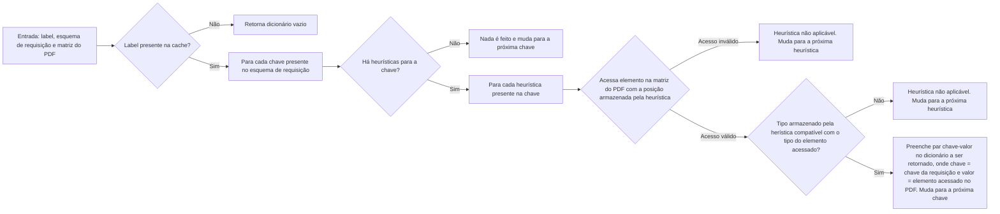
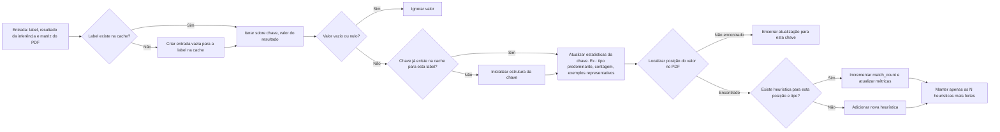

# AI Fellowship Data Repository

- [AI Fellowship Data Repository](#ai-fellowship-data-repository)
  - [📝 Descrição do problema](#-descrição-do-problema)
  - [💻 Stack](#-stack)
  - [💡 Estratégia](#-estratégia)
    - [🤖 LLM: reduzindo latência e custos](#-llm-reduzindo-latência-e-custos)
    - [🤯 Heurística](#-heurística)
      - [Pressupostos adotados](#pressupostos-adotados)
      - [Cache](#cache)
      - [Workflow](#workflow)
    - [💬 Alternância de prompt](#-alternância-de-prompt)
  - [👨🏻‍💻 Como usar](#-como-usar)
  - [🔢 Entrada e saída](#-entrada-e-saída)
    - [Entrada](#entrada)
    - [Saída](#saída)
  - [🧩 Melhorias e limitações reconhecidas](#-melhorias-e-limitações-reconhecidas)


Esse repositório contém um projeto desenvolvido durante o processo seletivo para o fellowship promovido pela empresa [Enter](https://www.getenter.ai/).

## 📝 Descrição do problema

O desafio proposto gira em torno do problema de extração eficiente de pares chave-valor a partir de documentos desestruturados. Conforme apontado por [esse paper](https://arxiv.org/abs/2405.00505), por exemplo, *Key-Value Pair Extraction* é uma tarefa crítica cuja solução eficiente permanece em aberto.

## 💻 Stack

Por questões de familiaridade e agilidade no desenvolvimento/prototipação, optou-se pela linguagem Python.

Além disso, como modelo de linguagem (LLM), utilizou-se o [gpt-5-mini](https://platform.openai.com/docs/models/gpt-5-mini), da OpenAI.

## 💡 Estratégia

### 🤖 LLM: reduzindo latência e custos

**Nota**: no contexto de inferência de modelos de linguagem: `tokens consumidos = custo`. Portanto, um aumento/redução no número de tokens implica um aumento/redução proporcional no custo final.

Sabendo que a interação com um LLM seria uma peça fundamental e inegociável, o primeiro passo tomado durante o desenvolvimento foi testar formas de diminuir custo e latência (uma vez que chamadas a LLMs costumam ser o gargalo operacional e financeiro da operação):

1. Percebendo que a tarefa de identificar pares chave-valor não demanda uma linha de raciocínio muito elaborada, o primeiro teste feito foi retirar (ou, praticamente retirar) a feature de `reasoning` do modelo, setando `reasoning={"effort": "minimal"}` (os testes foram feitos passando o PDF como texto via prompt). 
    - Resultado: de ~20s para ~3s (**7x menos**) e de ~1600 tokens totais para ~400 (**4x menos**), sendo que o resultado permaneceu satisfatório.
    - Obs.: quando `effort` não é especificado, o valor padrão é `medium`.

2. Para evitar formatos de saída indesejados (o que geraria problemas desnecessários de JSON parsing), utilizou-se a feature de [Structured model outputs](https://platform.openai.com/docs/guides/structured-outputs), garantindo que o modelo sempre responderia conforme o modelo JSON estabelecido (utilizando a lib. `pydantic`).

3. Como uma tentativa de "enguxar" ainda mais o prompt, o esquema de entrada foi passado na estrutura YAML, que utiliza menos tokens que o formato JSON - o resultado não foi significativo, um vez que essa é um estrtégia crítica para cenários onde o JSON passado no prompt é extremamente longo, o que não é o caso médio do desafio.

4. Para aproveitar melhor o [Prompt caching](https://platform.openai.com/docs/guides/prompt-caching) (reduzindo custo e latência), o prompt foi organizado de forma que as seções estáveis permaneçam no início, enquanto as partes variáveis são colocadas ao final, reduzindo a quantidade de conteúdo que precisa ser recarregado a cada requisição.

5. Por fim, testou-se passar o PDF de entrada de duas formas:
    1. Utilizando a feature de [File inputs](https://platform.openai.com/docs/guides/pdf-files?api-mode=responses) via base64, o que inevitavelmente aumenta custo e latência - uma vez que: "To help models understand PDF content, we put into the model's context both extracted text and an image of each page—regardless of whether the page includes images.", OpenAI.
    2. Utilizando apenas texto via engenharia de prompt. Realizar isso é complicado, uma vez que o layout desempenha um papel fundamental. Para contornar esse problema foi fornecido ao modelo um esquema que lhe permite entender o layout do arquivo original (aqui, começa a entrar a heurística utilizada, que será detalhada no próximo tópico) através de uma matriz. Exemplo para o arquivo `oab_1.pdf`:
        ```none
        Row 1: joana d'arc
        Row 2: inscrição | seccional | subseção
        Row 3: 101943 | pr | conselho seccional - paraná
        Row 4: suplementar
        Row 5: endereço profissional
        Row 6: avenida paulista, nº 2300 andar pilotis, bela vista
        Row 7: são paulo - sp
        Row 8: 01310300
        Row 9: telefone profissional
        Row 10: situação regular
        ```
        Apesar de modelos de linguagem serem, em essência, orientados a texto e não apresentarem desempenho ideal em dados tabulares, observou-se uma melhora significativa nos resultados quando as informações foram estruturadas em tabela/matriz, em comparação ao uso do texto corrido sozinho. Obviamente isso acabou resultando em um pequeno aumento de latência e tokens consumidos.
    
    **Resultados**: enviar o arquivo PDF para o LLM (via base64), em vez do texto extraído do PDF no prompt, resultou em aproximadamente **2x mais tempo** e **2x mais tokens**. Contudo, durante os experimentos, percebeu-se que, quando usando apenas texto, os resultados foram um pouco inferiores e menos consistentes. Exemplos:
    - Para a chave `"situacao"` dentro de `"label": "carteira_oab"`: em alguns casos, o modelo retornou apenas `"regular"`, enquanto em outros retornou `"situação regular"`. Além disso, para a chave `"endereco_profissional"` dentro da mesma categoria: partes finais do endereço foram ocasionalmente omitidas — como, por exemplo, o CEP.

    Os tópicos a seguir apresentam a abordagem adotada para lidar com esses problemas.

### 🤯 Heurística

#### Pressupostos adotados

1. Conjunto definido de layouts por label.
    - Assumiu-se que documentos com mesma label tendem a possuir um conjunto de layouts padrão. Ou seja, para uma mesma label existe um conjunto de configurações a partir das quais os dados estão dispostos.
2. Mesma chave, mesmo tipo.
    - Assumiu-se valores de labels e chaves iguais possuem o mesmo tipo/formato.
    - Exemplo: dada uma label, uma chave `nome` sempre conterá uma string, uma chave `data` sempre conterá um valor no formato de data, uma chave `valor_total` sempre conterá um valor numério, etc..
3. LLM acerta.
    - Assume-se que o resultados gerados pela LLM (principalmente quando alimentada com o arquivo PDF nativo) está correto.

#### Cache

A cache é um dicionário cujos valores são preenchidos de forma adaptativa ao longo do processamento dos PDFs. Sua estrutura segue três níveis:

1. **Nível 1**: chaves correspondendo às *labels* dos documentos (ex.: `carteira_oab`, `tela_sistema`, etc.), permitindo que heurísticas sejam especializadas por tipo de documento.

2. **Nível 2**: cada label possui um dicionário como valor, cujas chaves correspondem às *keys* do esquema.

3. **Nível 3**: cada key possui um dicionário como valor, cujas chaves são:
    1. `count`, que armazena a quantidade total de vezes que a key foi solicitada em um esquema de requisição,
    2. `heuristics`, que corresponde a uma lista de heurísticas aprendidas (a ideia é que cada heurística seja útil para um layout específico),
    3. `type`, que corresponde ao tipo predominante do valor correspondente e
    4. `example_values`, que corresponde a uma lista de valores prévios.

4. **Nível 4**: cada heurística é um dicionário cujas chaves são:
    1. `position`: posição do valor na representação matricial do conteúdo do PDF (ver módulo `utils.pdf2mat.py`),
    2. `match_count`: número de vezes que essa heurística foi usada,
    3. Se o tipo for `string`, há também a chave `mean_length`: armazena um float com o tamanho médio acumulado dos valores da chave.

    Exemplo da estrutura da cache:
    ```json
    "carteira_oab": {
        "nome": {
            "count": 3,
            "heuristics": [
                {
                    "position": [
                        0
                    ],
                    "match_count": 3,
                    "mean_length": 11
                }
            ],
            "type": "string",
            "example_values": [
                "joana d'arc",
                "luis filipe araujo amaral",
                "son goku"
            ]
        },
        "inscricao": {
            "count": 3,
            "heuristics": [
                {
                    "position": [
                        2,
                        0
                    ],
                    "match_count": 3
                }
            ],
            "type": "number",
            "example_values": [
                "101943"
            ]
        }
    }
    ```

**Antes de realizar a chamada ao modelo** executa-se um pré-processamento por meio do método `heuristic_preprocessing()`. Esse método utiliza a cache de heurísticas já aprendidas para tentar preencher automaticamente parte do esquema de extração (`request_schema`) antes da inferência. Para cada chave do esquema, o método verifica se existem heurísticas previamente armazenadas para a label do documento atual e, se existir, tenta recuperar o valor correspondente consultando diretamente a matriz do PDF. Os valores recuperados são armazenados em um dicionário parcial (`partial_result`), que representa os campos resolvidos apenas por heurística, sem consulta ao modelo. Durante esse processo, o método também ajusta contadores internos e estatísticas de uso das heurísticas, reforçando aquelas que se mostram mais eficazes.

**Após a inferência do modelo**, o método `heuristic_update()` é responsável por atualizar a cache com os novos resultados obtidos. Ele registra o valor retornado, determina seu tipo, coleta exemplos representativos e identifica a posição do valor no PDF, transformando esse conhecimento em novas heurísticas. Se uma heurística existente já corresponder ao valor observado, sua frequência de acerto é incrementada; caso contrário, uma nova heurística é adicionada. O conjunto é então reordenado para priorizar heurísticas mais consistentes, mantendo apenas as mais relevantes para uso futuro.

Em resumo: 
- `heuristic_preprocessing()`: antecipa o que pode ser inferido sem o modelo
- `heuristic_update()`: permite que o sistema aprenda continuamente com novas extrações, tornando-o mais eficiente conforme mais documentos são processados.

#### Workflow

Os fluxogramas abaixo demonstram como os métodos `heuristic_preprocessing()` e `heuristic_update()`, respectivamente, funcionam.
 




### 💬 Alternância de prompt

Conforme dito anteriormente, é evidente o *trade-off* entre passar o PDF nativo e passá-lo como uma representação textual estruturada no prompt: a extração via PDF nativo tende a ser mais precisa, custosa e lenta e a extração baseada na matriz textual é mais barata e rápida, mas pode ser menos fiel ao conteúdo original.

A seguinte estratégia foi utilizada para atacar esse desafio: para os casos em que a heurística não pôde contribuir significativamente com o preenchimento do request_schema (quando o percentual de chaves preenchidas pela heurística para um determinado documento foi menor ou igual a um limiar predefinido - 50% no código, valor pode ser ajustado) o sistema opta por utilizar a extração baseada no PDF nativo. Assim, além de garantir maior precisão, também permite atualizar a heurística com dados mais precisos e confiáveis.

Nos casos em que o programa opta por utilizar a representação textual no prompt, além de enviar o esquema de extração em YAML, também são inseridos exemplos previamente observados pela heurística para cada chave. Esses exemplos não são utilizados como valores fixos, mas como pistas semânticas para auxiliar o modelo - uma vez que essa abordagem tende a ser mais imprecisa. Em outras palavras, caso a heurística já tenha visto valores associados àquela mesma chave em documentos da mesma label, tais valores servem como sinalização do formato esperado, da terminologia utilizada ou da forma como aquela informação costuma aparecer.

Essa **abordagem híbrida** tenta explorar o melhor dos dois mundos: prioriza custo e eficiência quando há histórico e conhecimento acumulado para aquela label, enquanto recorre ao PDF nativo para maximizar precisão justamente nos casos em que o risco de erro ou ambiguidade é maior.


## 👨🏻‍💻 Como usar

1. Clone o repositório
    ```bash
    git clone https://github.com/joaoloss/ia-fellowship.git
    cd ia-fellowship
    ```

2. Crie um `.env`
    ```
    OPENAI_API_KEY=<sua-chave-api>
    ```

3. Inicialize o ambiente com [uv](https://docs.astral.sh/uv/)
    ```bash
    uv init
    uv sync
    ```

    Obs.: caso esteja utilizando o repositório pela primeira vez, o uv criará automaticamente o ambiente isolado e instalará todas as dependências definidas no `pyproject.toml`.

4. Execução do Programa

    O programa pode ser utilizado de duas maneiras: via linha de comando (**CLI**) ou via interface gráfica (**UI**).

    - **CLI mode**
        ```bash
        uv run main.py [-h] [--verbose {debug,info,warning,error,tqdm}] [--input-json INPUT_JSON]
        ```

    - `--verbose`: Nível de detalhamento dos logs. Pode ser: debug, info, warning, error ou tqdm (default: info).

    - `--input-json`: Nome do arquivo JSON de entrada quando executado em modo CLI (default: dataset.json).

        Exemplo:
        ```bash
        uv run main.py --verbose tqdm --input-json input.json
        ```
    
    - **UI mode**
        ```bash
        uv run streamlit run main.py  -- --streamlit 
        ```

        Em seguida acesse `http://localhost:8501` no navegador.

    Ao executar o programa via interface gráfica (**UI**), além do processamento padrão, a aplicação apresenta **estatísticas e visualizações interativas** relacionadas ao processo de extração — incluindo tempo de execução, custo estimado e desempenho da heurística.

## 🔢 Entrada e saída

### Entrada

Os arquivos PDF referenciados pelo JSON de entrada devem estar na pasta `files`. Além disso o JSON de entrada deve seguir o seguinte padrão:
```json
[
    {
        "label": "carteira_oab",
        "extraction_schema": {
            "nome": "Nome do profissional, normalmente no canto superior esquerdo da imagem",
            "inscricao": "Número de inscrição do profissional",
            "seccional": "Seccional do profissional",
            "subsecao": "Subseção à qual o profissional faz parte",
            "categoria": "Categoria, pode ser ADVOGADO, ADVOGADA, SUPLEMENTAR, ESTAGIARIO, ESTAGIARIA",
            "endereco_profissional": "Endereço do profissional",
            "telefone_profissional": "Telefone do profissional",
            "situacao": "Situação do profissional, normalmente no canto inferior direito."
        },
        "pdf_path": "oab_1.pdf"
    }
]
```

### Saída

1. `results_<time-stamp>.json`: arquivo contendo o resultado do processamento juntamente com dados estatísticos.

    Exemplo:
    ```json
    [
        {
            "extraction_schema": {
                "nome": "luis filipe araujo amaral",
                "inscricao": "101943",
                "seccional": "pr",
                "subsecao": "conselho seccional - paraná",
                "categoria": "suplementar",
                "endereco_profissional": "avenida paulista, nº 2300 andar pilotis, bela vista são paulo - sp\n\n01310300",
                "situacao": "situação regular"
            },
            "metadata": {
                "pdf_path": "oab_2.pdf",
                "label": "carteira_oab",
                "version_used": "text_based",
                "latency_seconds": 2.3,
                "total_tokens": 611,
                "input_tokens": 562,
                "output_tokens": 49,
                "cached_tokens": 0,
                "reasoning_tokens": 0,
                "estimated_cost_usd": "2.385000e-04",
                "heuristic_hits": [
                    "nome",
                    "inscricao",
                    "seccional",
                    "subsecao",
                    "categoria"
                ]
            }
        }
    ]
    ```

2. `debug_outputs/`: contém artefatos auxiliares para depuração, incluindo a representação matricial dos PDFs e um JSON com o estado final da cache de heurísticas aprendidas durante o processamento.

## 🧩 Melhorias e limitações reconhecidas

Como o algoritmo é apenas um protótipo, é importante pontuar limitações/melhorias reconhecidas:

1. A versão atual da heurística construída **não identifica chaves ausentes**, o que aumenta a dependência do modelo de linguagem. Versões futuras poderiam contornar esse problema.
2. **Ausência de paralelismo/multithreading**: adicionar essa feature é um desafio que, infelizmente, não pôde ser solucionado por questão de prazo. Contudo, há alguns problemas que tornam a inserção dessa feature não trivial:
   1. Problema de sincronismo: ao processar múltiplos PDFs em paralelo, a ordem de processamento deixa de ser garantida, ou seja, a ordem de saída pode não corresponder à ordem de entrada.
   2. Efetividade reduzida da heurística: a heurística depende do acúmulo progressivo de informações — quanto mais documentos são processados, melhor ela fica. Entretanto, com múltiplas threads, documentos que são processados logo no início podem não se beneficiar da heurística simplesmente porque ela ainda não foi atualizada por outras threads. 
   
        Uma possível solução seria manter o processamento sequencial durante um determinado período ou até que um número mínimo de documentos tenha sido processado.
3. A heurística está fortemente ligada à identificação de padrões de layout presentes nos documentos. Embora seja capaz de armazenar e reconhecer múltiplas variações desses padrões, seu desempenho depende diretamente da recorrência entre os PDFs de uma mesma label. Quanto mais estáveis forem esses padrões, maior tende a ser a cobertura heurística.
4. Como a heurística é adaptativa (aprendizado acumulativo) para extrações isoladas o resultado não é otimizado.
5. O tratamento de erros e inconsistências ainda pode ser aprimorado, especialmente em cenários não previstos ou de entrada inválida.