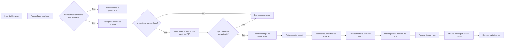

# AI Fellowship Data Repository

- [AI Fellowship Data Repository](#ai-fellowship-data-repository)
  - [📝 Descrição do problema](#-descrição-do-problema)
  - [💻 Stack](#-stack)
  - [💡 Estratégia](#-estratégia)
    - [🤖 LLM: reduzindo latência e custos](#-llm-reduzindo-latência-e-custos)
    - [🤯 Heurística](#-heurística)
      - [Pressupostos adotados](#pressupostos-adotados)
      - [Cache](#cache)
      - [Workflow](#workflow)


Esse repositório contém um projeto desenvolvido durante o processo seletivo para o fellowship promovido pela empresa [Enter](https://www.getenter.ai/).

## 📝 Descrição do problema

O desafio proposto gira em torno do problema de extração eficiente de pares chave-valor a partir de documentos desestruturados. Conforme apontado por [esse paper](https://arxiv.org/abs/2405.00505), por exemplo, *Key-Value Pair Extraction* é uma tarefa crítica cuja solução eficiente permanece em aberto.

## 💻 Stack

Por questões de familiaridade e agilidade no desenvolvimento/prototipação, optou-se pela linguagem Python.

Além disso, como modelo de linguagem (LLM), utilizou-se o [gpt-5-mini](https://platform.openai.com/docs/models/gpt-5-mini) da OpenAI.

## 💡 Estratégia

### 🤖 LLM: reduzindo latência e custos

**Nota**: no contexto de inferência de modelos de linguagem: `tokens consumidos = custo`. Portanto, um aumento/redução no número de tokens implica um aumento/redução proporcional no custo final.

Sabendo que a interação com um LLM seria uma peça fundamental e inegociável, o primeiro passo tomado durante o desenvolvimento foi testar formas de diminuir custo e latência (uma vez que chamadas a LLMs costumam ser o gargalo operacional e financeiro da operação):

1. Percebendo que a tarefa de identificar pares chave-valor não demanda uma linha de raciocínio muito elaborada, o primeiro teste feito foi retirar (ou, praticamente retirar) a feature de `reasoning` do modelo, setando `reasoning={"effort": "minimal"}` (os testes foram feitos passando o PDF como texto via prompt). 
    - Resultado: de ~20s para ~3s (**7x menos**) e de ~1600 tokens totais para ~400 (**4x menos**), sendo que o resultado permaneceu satisfatório.
    - Obs.: quando `effort` não é especificado, o valor padrão é `medium`.

2. Para evitar formatos de saída indesejados (o que geraria problemas desnecessários de JSON parsing), utilizou-se a feature de [Structured model outputs](https://platform.openai.com/docs/guides/structured-outputs), garantindo que o modelo sempre responderia conforme o modelo JSON estabelecido (utilizando a lib. `pydantic`).

3. Como uma tentativa de "enguxar" ainda mais o prompt, o esquema de entrada foi passado na estrutura YAML, que utiliza menos tokens que o formato JSON - o resultado não foi significativo, um vez que essa é um estrtégia crítica para cenários onde o JSON passado no prompt é extremamente longo, o que não é o caso médio do desafio.

4. Por fim, testou-se passar o PDF de entrada de duas formas:
    1. Utilizando a feature de [File inputs](https://platform.openai.com/docs/guides/pdf-files?api-mode=responses) via base64, o que inevitavelmente aumenta custo e latência - uma vez que: "To help models understand PDF content, we put into the model's context both extracted text and an image of each page—regardless of whether the page includes images.", OpenAI.
    2. Utilizando apenas texto via engenharia de prompt. Realizar isso é complicado, uma vez que o layout desempenha um papel fundamental. Para contornar esse problema utilizou-se a seguinte estratégia: além de passar o texto "cru" e corrido, também foi fornecido ao modelo um esquema que lhe permitiria entender o layout do arquivo original (aqui, começa a entrar a heurística utilizada, que será detalhada no próximo tópico) através de uma matriz. O exemplo abaixo mostra os dos dois formatos para o arquivo `oab_1.pdf`:
        - Texto corrido:
            ```none
            joana d'arc inscrição seccional subseção 101943 pr conselho seccional - paraná suplementar endereço profissional avenida paulista, nº 2300 andar pilotis, bela vista são paulo - sp 01310300 telefone profissional situação regular
            ```
        - Formato estruturado:
            ```none
            Row 1: joana d'arc
            Row 2: inscrição | seccional | subseção
            Row 3: 101943 | pr | conselho seccional - paraná
            Row 4: suplementar
            Row 5: endereço profissional
            Row 6: avenida paulista, nº 2300 andar pilotis, bela vista
            Row 7: são paulo - sp
            Row 8: 01310300
            Row 9: telefone profissional
            Row 10: situação regular
            ```
        Apesar de modelos de linguagem serem, em essência, orientados a texto e não apresentarem desempenho ideal em dados tabulares, observou-se uma melhora significativa nos resultados quando as informações foram estruturadas em tabela/matriz, em comparação ao uso do texto corrido sozinho. Obviamente isso acabou resultando em um pequeno aumento de latência e tokens consumidos.
    
    **Resultados**: enviar o arquivo PDF para o LLM (via base64), em vez do texto extraído do PDF no prompt, resultou em aproximadamente **2x mais tempo**, **2x mais tokens**. Contudo, durante os experimentos, percebeu-se que os resultados foram um pouco inferiores e menos consistentes. Exemplos:
    - Para a chave `"situacao"` dentro de `"label": "carteira_oab"`: em alguns casos, o modelo retornou apenas `"regular"`, enquanto em outros retornou `"situação regular"`. Além disso, para a chave `"endereco_profissional"` dentro da mesma categoria: partes finais do endereço foram ocasionalmente omitidas — como, por exemplo, o CEP.

    Abaixo tem-se o resultado para `oab_1.pdf` utiliando as duas abordagens:
    - Passando o arquivo:
    ```json
    "extraction_schema": {
            "nome": "JOANA D'ARC",
            "inscricao": "101943",
            "seccional": "PR",
            "subsecao": "CONSELHO SECCIONAL - PARANÁ",
            "categoria": "SUPLEMENTAR",
            "endereco_profissional": "AVENIDA PAULISTA, Nº 2300 andar Pilotis, Bela Vista SÃO PAULO - SP 01310300",
            "telefone_profissional": null,
            "situacao": "SITUAÇÃO REGULAR"
        },
        "latency_seconds": 7.63,
        "total_tokens": 1573,
        "input_tokens": 1471,
        "output_tokens": 102
    ```
    - Usando apenas texto:
    ```json
    "extraction_schema": {
            "nome": "joana d'arc",
            "inscricao": "101943",
            "seccional": "pr",
            "subsecao": "conselho seccional - paraná",
            "categoria": "SUPLEMENTAR",
            "endereco_profissional": "avenida paulista, nº 2300 andar pilotis, bela vista",
            "telefone_profissional": null,
            "situacao": "regular"
        },
        "latency_seconds": 2.47,
        "total_tokens": 796,
        "input_tokens": 713,
        "output_tokens": 83
    ````

### 🤯 Heurística

#### Pressupostos adotados

1. Conjunto definido de layouts por label.
    - Assumiu-se que documentos com mesma label tendem a possuir um conjunto de layouts padrão. Ou seja, para uma mesma label existe um conjunto de configurações a partir das quais os dados estão dispostos.
2. Mesma chave, mesmo tipo.
    - Assumiu-se valores de labels e chaves iguais possuem o mesmo tipo/formato.
    - Exemplo: dada uma label, uma chave `nome` sempre conterá uma string, uma chave `data` sempre conterá um valor no formato de data, uma chave `valor_total` sempre conterá um valor numério, etc..
3. LLM acerta.
    - Assume-se que o resultado gerado pela LLM está correto.

#### Cache

A cache é um dicionário cujos valores são preenchidos de forma adaptativa ao longo do processamento dos PDFs. Sua estrutura segue três níveis:

1. **Nível 1**: chaves correspondendo às *labels* dos documentos (ex.: `carteira_oab`, `tela_sistema`, etc.), permitindo que heurísticas sejam especializadas por tipo de documento.

2. **Nível 2**: cada label possui um dicionário como valor, cujas chaves correspondem às *keys* do esquema.

3. **Nível 3**: cada key possui um dicionário como valor, cujas chaves são:
    1. `count`, que armazena a quantidade total de vezes que a key foi solicitada em um esquema de requisição, e
    2. `heuristics`, que corresponde a uma lista de heurísticas aprendidas.

4. **Nível 4**: cada heurística é um dicionário cujas chaves são:
    1. `type`: tipo de dado (ver módulo `utils.type_resolution.py`),
    2. `position`: posição do valor na representação matricial do conteúdo do PDF (ver módulo `utils.pdf2mat.py`),
    3. `match_count`: número de vezes que essa heurística foi usada,
    4. Se o tipo for `string`, há também a chave `mean_length`: armazena um float com o tamanho médio acumulado dos valores da chave.

A cada nova extração, o método `heuristic_update()` atualiza o cache reforçando heurísticas existentes ou adicionando novas, priorizando as que apresentam maior frequência de acertos.
Posteriormente, no processo de pré-inferência (método `heuristic_preprocessing()`), essas heurísticas são utilizadas para preencher automaticamente valores do esquema de requisição, reduzindo a quantidade de dados solicitados ao modelo de linguagem.

#### Workflow

Com base nos pressupostos listados, a heurística criada segue os seguintes passos:

